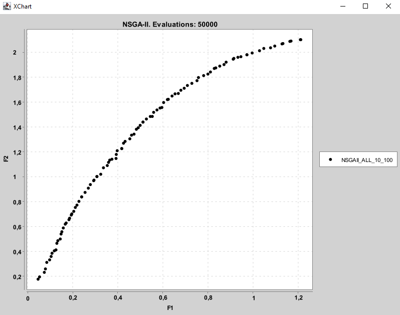

# ParetoInvest

**ParetoInvest** is an advanced tool designed to facilitate portfolio optimization using bio-inspired algorithms. Developed in Python and integrated with the jMetal library, this application enables researchers and financial professionals to model and solve complex asset allocation problems, taking into account multiple conflicting objectives such as expected return, risk, and diversification. Its modular design and intuitive graphical interface simplify the configuration of advanced evolutionary algorithms, making this technology accessible even to users with no prior experience in metaheuristics.

One of the most distinctive features of ParetoInvest is its direct integration with real-time financial data sources from the U.S. market. This module allows users to run realistic simulations that accurately reflect current market conditions, eliminating the need for manual data collection and preprocessing. The platform supports downloading, storing, and exporting financial datasets in standard formats like CSV, encouraging experiment reproducibility and facilitating external analysis in tools such as Python, R, or MATLAB.

The tool supports several state-of-the-art multi-objective optimization algorithms, including NSGA-II, MOEA/D, SMSEMOA, SMPSO, and their variants. Each algorithm can be customized through a set of configurable parameters such as population size, number of evaluations, crossover and mutation types, and portfolio constraints. In addition, the system automatically generates efficient solutions (Pareto front), which can be visualized dynamically and ranked using metrics such as the Sharpe ratio to assist in informed financial decision-making.

ParetoInvest is designed as an open, reproducible, and extensible platform. Its architecture enables the evaluation of algorithm behavior under realistic conditions, comparison of results, and export of all relevant artifacts for documentation or academic publication. By democratizing access to sophisticated multi-objective optimization techniques, this tool supports the development of robust and adaptive investment strategies aligned with market evolution and the specific needs of each investor profile.

This repository accompanies the scientific article:

> **ParetoInvest: Integrating Real-Time Financial Data and Multi-Objective Metaheuristics for Portfolio Optimization**  
> Antonio J. Hidalgo-Marín, Antonio J. Nebro, José García-Nieto  
> Submitted to *SoftwareX*, May 28, 2025.

---

## 📌 Motivation

Today’s financial landscape is characterized by high complexity, volatility, and the need to simultaneously consider multiple conflicting objectives—such as maximizing return, minimizing risk, and ensuring diversification. Traditional optimization tools often fall short when addressing these challenges, particularly in large-scale datasets and fast-changing market environments.

ParetoInvest was developed to overcome these limitations by offering an integrated platform that automates the retrieval of real-time financial data, the configuration and execution of multi-objective evolutionary algorithms, and the visualization of results through an intuitive graphical interface. Its design targets both researchers and financial professionals who want to focus on decision-making rather than the technical intricacies of underlying methods.

The tool leverages state-of-the-art evolutionary algorithms—powered by the jMetal framework—to efficiently explore complex solution spaces and generate Pareto fronts that reflect optimal trade-offs between financial objectives. Furthermore, its data management system enables export in standard formats and supports transparent, reproducible experimentation.

Altogether, ParetoInvest democratizes access to advanced optimization techniques in finance, lowering technical barriers and promoting reproducible, data-driven strategies for optimal portfolio selection. It is a valuable tool for both academic research and practical decision-making in real-world financial contexts.

**ParetoInvest** bridges this gap by providing a ready-to-use, customizable tool that:
- Automates the retrieval of real-time financial data.
- Applies advanced metaheuristics to find Pareto-efficient portfolios.
- Visualizes trade-offs and enables reproducible experimentation.

---

## 🔍 Key Features

- 🧠 **Multi-Objective Optimization** using NSGA-II, MOEA/D, SMPSO, SMSEMOA, and others.
- 📈 **Real-Time Data Integration** from U.S. financial markets.
- 🖥️ **Graphical User Interface (GUI)** for configuring algorithms and visualizing results.
- 📤 **Exportable Results** in CSV format.
- 📊 **Pareto Front Visualization** to compare optimization strategies.
- 🧪 **Reproducible Experiments** with configurable parameters.
- 🔗 **Interoperable with jMetal**, the reference Java framework for multi-objective metaheuristics.

---

## 🧰 Use Cases

📌 Use Cases
ParetoInvest is designed to support a wide range of applications in financial decision-making and algorithmic experimentation. Below are some representative use cases:

1. 🧠 Academic Research and Benchmarking
Researchers can flexibly configure the problem by adjusting the input parameters, selecting different sets of financial assets, and modifying the configuration of the optimization algorithms. This enables rigorous experimentation under varying conditions to assess the performance of multi-objective evolutionary algorithms (MOEAs) such as NSGA-II, MOEA/D, SMPSO, or SMSEMOA. The platform supports reproducible studies and facilitates exporting results for comparative analysis, algorithm tuning, or academic publication.

2. 📊 Portfolio Strategy Development
Financial analysts can rapidly simulate large volumes of real market data to identify the most promising combinations of assets for investment, as well as the optimal allocation for each asset. The system enables efficient exploration of multi-asset configurations, supporting data-driven decision-making through the generation of Pareto-optimal portfolios. The system generates Pareto-optimal portfolios that can be analyzed interactively to support informed decision-making.

3. 🔄 Real-Time Market Simulations
By integrating real-time data feeds from U.S. markets, ParetoInvest enables users to simulate investment strategies under current market conditions. This allows validation of portfolio strategies that are responsive to ongoing market trends. ParetoInvest uses real financial market data from major U.S. exchanges, ensuring that all simulations are grounded in actual historical and live market behavior. Users can choose to work with current up-to-date data feeds, enabling the simulation and validation of investment strategies that reflect present market conditions and trends.

4. ⚙️ Parameter Tuning and Metaheuristic Testing
Users can configure a wide range of algorithmic and problem-related parameters—including populationSize, maxEvaluations, numberOfAssetsStudied, totalNumberOfAssets, marketSelection, dateRange, crossoverProbability, crossoverDistributionIndex, and mutationDistributionIndex. These settings allow researchers and practitioners to explore the impact of algorithm behavior on convergence speed, solution diversity, and optimization quality. Additional parameters are also available to support fine-grained control and experimental tuning of metaheuristics.

5. 🧩 Integration with External Systems
Through its modular architecture, ParetoInvest supports integration with financial data platforms and services, facilitating seamless access to market information and easing the transition between data acquisition, analysis, and portfolio optimization. The system provides both raw and processed (aggregated) data files, enabling seamless interoperability with other tools. Beyond generating and optimizing investment portfolios, ParetoInvest can also serve as a data provider, extending its scope and utility across diverse analytical and operational workflows.

✅ Summary of Typical Applications

- Design and evaluate portfolio optimization.  
- Simulate large investment scenarios accurately.  
- Validate strategies using real-time data.  
- Tune metaheuristics for better performance.  
- Export data for external integration.

---
## ⚙️ Installation

### Requirements

To run ParetoInvest, ensure you have the following installed:

- **Python 3.9** – Required for compatibility with the libraries used.
- **Git** – To clone the repository from GitHub.
- **Java 22 (optional)** – Only required if you plan to use the jMetal engine for metaheuristic optimization.
- **Internet connection** – Needed to retrieve real-time financial data and updates.

---

### 🔧 Installation with Poetry (Recommended)

ParetoInvest uses [Poetry](https://python-poetry.org/) to manage dependencies and isolate the environment. This is the cleanest and most reproducible way to install and run the project.

#### Steps:

```bash
# 1. Clone the repository
git clone https://github.com/AntHidMar/ParetoInvest.git
cd ParetoInvest

# 2. Install Poetry (if not already installed)
pip install poetry

# 3. Install project dependencies and create a virtual environment
poetry install

# 4. Activate the virtual environment
poetry shell

# 5. Run the application (you can customize the script path in the config file)
python main.py
```

To exit the virtual environment:

```bash
exit
```

Optional: export dependencies to a `requirements.txt` file (for legacy setups):

```bash
poetry export -f requirements.txt --output requirements.txt --without-hashes
```

---

## 🧪 Continuous Validation with GitHub Actions

This project includes a **Continuous Integration (CI)** workflow powered by **GitHub Actions**, ensuring that the application can be **installed, executed, and packaged successfully** in a clean Windows environment.

Every time a *commit* or *pull request* is made to the main branches (`main` or `master`), the workflow defined in  
`.github/workflows/build.yml` is automatically triggered. It performs the following checks:

- Sets up a fresh environment with **Python 3.11** and **Poetry**.  
- Installs all required dependencies.  
- Runs a **smoke test** to verify that the application launches correctly without critical errors.  
- Uploads the `.exe` as a GitHub artifact to demonstrate that the application runs.
- Builds the final executable using **PyInstaller** and uploads it as a downloadable artifact.

This process serves as an **automated installation and execution validation**, confirming that the project remains buildable and functional after each update.

> 🧠 *Smoke tests* don’t deeply test the business logic — instead, they ensure that the installation, dependencies, and packaging process remain stable across versions.
> **Note:** The current workflow generates the executable, but for full functionality, you need to ensure that the **configuration and resources directories** (such as `config/`, `resources/`) are present in the root directory next to the executable, because the app relies on them at runtime.

The resulting executable (`main.exe`) can be downloaded from  
**Actions → Run details → Artifacts** in the GitHub interface.

[workflow deploy](https://github.com/AntHidMar/ParetoInvest/actions)

---

## Docker & Continuous Integration

This project provides a Dockerized environment to simplify installation, testing, and deployment, while also supporting automated CI pipelines (e.g., GitHub Actions). The main goal is to allow running the application and tests consistently across different machines without GUI dependencies during CI execution.

### Docker Setup

A `Dockerfile` is included in the repository with the following features:

- **Base image:** `ubuntu:22.04` with Python 3.11.
- **System dependencies:** Essential build tools, Qt runtime libraries, font configuration, and OpenGL libraries required by PyQt6.
- **Python environment:** Managed using [Poetry](https://python-poetry.org/), with virtual environments stored inside the container.
- **PyQt6 installation:** Installed globally to avoid issues with GUI dependencies.
- **CI-safe execution:** The `main.py` entry point detects CI environments (`CI=true` or `GITHUB_ACTIONS=true`) and disables GUI initialization automatically.

### Building the Docker Image

To build the Docker image locally:

```bash
docker build -t paretoinvest:latest .

---

### 🧰 Local installation and testing with Poetry

To reproduce the same process locally, you can run the following commands:

```bash
# 1. Install dependencies
poetry install
poetry run pip install PyQt5 pyinstaller pytest

# 2. Run tests
poetry run pytest tests -v

# 3. Build the executable
poetry run pyinstaller --noconfirm --onefile --windowed main.py

---

### 🛠️ Configuration

The application includes a `config/` folder with the file `config.json`, used to define the runtime environment when launching the application from the provided batch script (`ParetoInvest.bat` on Windows).

#### `config/config.json`

```json
{
  "ANACONDA_ROOT": "C:/Path/To/Anaconda3",
  "ENV_NAME": "ParetoInvest",
  "SCRIPT_NAME": "ParetoInvest/main.py"
}
```

- `ANACONDA_ROOT`: Path to your local Anaconda installation.
- `ENV_NAME`: Name of the Conda environment to activate.
- `SCRIPT_NAME`: Python script to launch (usually `main.py`).


## 🔗 Broker Integrations

ParetoInvest integrates with **two financial data providers** to streamline the investment analysis workflow:

### 1. 🐦 Alpaca – Asset List Provider

Alpaca is used to **retrieve the list of financial assets** (e.g., stocks) with which the user wants to work.  
To enable this functionality, you need to configure API access in a JSON file:

#### 🔐 `Librerias/Lib_Alpaca.json`

```json
{
  "Paper": {
    "API_KEY": "",
    "API_SECRET": "",
    "BASE_URL": "https://paper-api.alpaca.markets",
    "TIPO": "Paper"
  }
}
```
```
{
"Live":{
    "API_KEY" : "",
    "API_SECRET" : "",
    "BASE_URL" : "https://api.alpaca.markets",
    "TIPO" : "Live"
  }
}
```

- **Key (e.g., "Paper")**: Name of the environment you have created in Alpaca (e.g., Paper or Live).
- **API_KEY**: Your personal Alpaca API key.
- **API_SECRET**: Your Alpaca secret key.
- **BASE_URL**: The endpoint for Alpaca’s API (e.g., paper or live trading).
- **TIPO**: Type of environment (typically "Paper" or "Live").

#### 🛡️ Personal API Keys

To avoid accidentally sharing sensitive credentials, you can create a private configuration file:


---

### 2. 🏦 Interactive Brokers (IB) – Data Downloader

IB is used to **download historical financial data** for the selected assets. This integration relies on the **IB Gateway** or **TWS (Trader Workstation)** being active on your machine.

- The system connects via `ib_insync` and requires:
  - Gateway to be installed and running.
  - Proper account permissions for data access.

If you don’t have the IB Gateway properly configured and active, **you will not be able to download data** from Interactive Brokers.

---

### 📦 Alternative: Use Preloaded Data

For users who want to **avoid setting up broker connections**, we provide a public dataset with large-scale financial data, ready to use for testing and experimentation.

📁 These datasets are available in the associated **ParetoInvest Data Repository** (see [GitHub repo](https://github.com/AntHidMar/ParetoInvest) for details).

You can simply place the files in the `data/` directory and begin working with historical data without needing any broker account.

---

By clearly separating the data source responsibilities:

- **Alpaca** → Defines the *universe of assets*.
- **IB** → Provides *real market data* for those assets.

ParetoInvest supports both manual and automated workflows, adaptable to researchers, analysts, and beginners alike.


## 🧠 Supported Algorithms

ParetoInvest supports several state-of-the-art metaheuristics from different paradigms of multi-objective optimization. These algorithms explore the solution space in different ways and offer unique advantages depending on the portfolio problem characteristics:

| Algorithm   | Type             | Description |
|-------------|------------------|-------------|
| **NSGA-II**     | Dominance-based  | Fast non-dominated sorting + elitism. |
| **MOEA/D**      | Decomposition    | Solves multiple scalar subproblems cooperatively. |
| **SMSEMOA**     | Indicator-based  | Maximizes hypervolume. |
| **SMPSO**       | Swarm-based      | Particle Swarm Optimization for multi-objective problems. |
| **MOEA/D-DE**   | Hybrid           | MOEA/D with Differential Evolution. |

---

### 🔍 Comparative Overview

#### 🔷 **NSGA-II (Non-dominated Sorting Genetic Algorithm II)**
- **Key Feature:** Uses non-dominated sorting to classify solutions and a crowding-distance mechanism to maintain diversity.
- **Why It Matters:** Excellent baseline algorithm; provides a good balance between convergence and diversity.
- **When to Use:** When you want fast, stable results and a well-distributed Pareto front without fine-tuning.

#### 🔶 **MOEA/D (Multi-Objective Evolutionary Algorithm based on Decomposition)**
- **Key Feature:** Decomposes a multi-objective problem into a set of scalar optimization subproblems.
- **Why It Matters:** Very efficient in large-scale problems where cooperation among subproblems can improve convergence.
- **When to Use:** When you're optimizing portfolios with many objectives or need precise control over the solution distribution.

#### 🟦 **SMSEMOA (S-Metric Selection EMOA)**
- **Key Feature:** Uses the **hypervolume indicator** to guide selection.
- **Why It Matters:** Directly targets Pareto front quality by maximizing dominated space, which is useful for high-stakes or fine-tuned optimization.
- **When to Use:** When solution quality (in terms of Pareto dominance) is more important than speed.

#### 🟧 **SMPSO (Speed-constrained Multi-objective PSO)**
- **Key Feature:** A Particle Swarm Optimization (PSO) algorithm adapted for multi-objective problems.
- **Why It Matters:** Swarm-based dynamics promote faster convergence and can handle noisy or irregular search spaces better.
- **When to Use:** When portfolio fitness functions are non-smooth, noisy, or complex to evaluate.

#### 🟩 **MOEA/D-DE (MOEA/D + Differential Evolution)**
- **Key Feature:** Enhances MOEA/D with Differential Evolution (DE) operators for exploration.
- **Why It Matters:** Combines the structured search of MOEA/D with the exploratory capabilities of DE to avoid local optima.
- **When to Use:** For problems that need both exploitation and exploration—e.g., dynamic financial environments or constrained portfolios.

---

Each algorithm can be configured through the GUI with customizable parameters:
- **Population Size**
- **Number of Evaluations**
- **Crossover and Mutation Operators**
- **Selection Strategies**
- **Termination Criteria**

Together, they enable both experimentation and production-grade portfolio optimization across various risk-return trade-off preferences.

---

### 🔁 Reproducibility and Seed Functionality

ParetoInvest includes a **Seed** parameter designed to control the randomness of the optimization algorithms and ensure full reproducibility when required.

When running any evolutionary or stochastic optimization algorithm, random processes — such as population initialization, crossover, and mutation — can lead to different results each time. To address this, ParetoInvest allows the user to set a fixed **seed value** that determines how these random numbers are generated.

- If the user enters a **seed value greater than 0**, ParetoInvest uses this number to initialize the random number generator.  
  This ensures that every time the experiment is executed with the same seed, dataset, and study dates, the algorithm will produce **exactly the same results** (e.g., identical Pareto fronts, portfolios, and performance metrics).  
  This functionality is essential for **scientific reproducibility** and for comparing algorithmic configurations under controlled conditions.

- If the user sets the **seed to 0**, the reproducibility control is disabled, and the algorithm will use a different random initialization each time it runs.  
  This mode is useful when exploring the **stochastic variability** of results or when searching for diverse portfolio configurations.

The seed value can be entered directly through the GUI in the **“Seed”** textbox.  
By default, the field is set to `0`, meaning results will vary across executions unless the user specifies a deterministic seed manually.

---

## 📂 Project Structure

```
paretoinvest/
├── __init__.py
├── main.py (o app.py)
├── data/               # Sample financial datasets
├── gui                 # user interfaz files
├── jar                 # JMetal compilation files
├── Librerias           # External Libraries files
├── LOG                 # Information record executions
├── models              # Integracion files with externals software
├── resources           # Files to feed integration JMetal algorhims
├── ui                  # Main app file
├── requirements.txt    # Python dependencies
├── LICENSE             # GNU GPL license
├── README.md           # Project documentation
├── pyproject.toml      # Build system configuration for Python (PEP 518)
├── poetry.lock         # Exact versions of installed packages (Poetry)
└── .gitignore          # Excluded files
```

---

## 📊 Example Workflow

1. Launch the app and select the optimization algorithm (e.g., NSGA-II).
2. Load historical or real-time financial data.
3. Configure objectives (maximize return, minimize volatility, promote diversification).
4. Execute the optimization process.
5. Analyze and compare results using the visual Pareto front.
6. Export portfolios and metrics for further analysis.

---

## 🚀 How to Use ParetoInvest

To begin using ParetoInvest, follow the steps below to download the list of assets to study and ensure proper configuration:

### 📥 Download the Asset List
ParetoInvest connects to a broker to download an up-to-date list of assets currently being traded in the U.S. stock market.

- The asset list will be downloaded to the directory:
  ```
  data\Assets\Assets.csv
  ```
- The previous file will be renamed using the current date in the format `Assets_yyyy_mm_dd.csv`. This ensures that each version of the asset list is stored for future reference.

### ⚙️ Configure Alpaca Access
To enable asset downloading, you must have a valid Alpaca account. The API credentials must match those defined in the following configuration file:

```
config\Lib_Alpaca.json
```

Example configuration:
```json
"Paper": {
  "API_KEY": "",
  "API_SECRET": "",
  "BASE_URL": "https://paper-api.alpaca.markets",
  "TIPO": "Paper"
}
```

### 🔑 Alpaca Account Required
- You must register for an account with [Alpaca](https://alpaca.markets/).
- Make sure your API key, secret, and base URL correspond to those in the `Lib_Alpaca.json` configuration file.
- The application will not work unless these credentials are valid and correctly configured.


### 📂 Download Financial Data from Interactive Brokers

The second button in the application interface, labeled **Download**, allows you to obtain historical data for the assets listed in `Assets.csv` by connecting to Interactive Brokers (IB).

- You must have the Interactive Brokers **Gateway** configured and running on port `4001`.
- The total number of assets to download is controlled by the value in the **textbox** labeled `Numero total de activos`.
- Once the process starts, a **progress bar** will indicate how many assets are being downloaded and the current download status.

Downloaded `.csv` files will be saved in the following directory structure:

```
data\financial_data\
  IB_Day\
  IB_Month\
  IB_Hour\
  IB_Year\
```

- The frequency is selected using the listbox.
- Each subdirectory corresponds to a frequency.
- Inside each folder, there will be one file per asset, named as:

```
<Frequency>_<AssetName>_.csv
```

- Example: `IB_Day_AAPL_.csv` for daily data of Apple stock.

Make sure your IB Gateway is correctly configured and running before starting the download.

---

## Sample Data for Testing

This project includes two `.zip` files containing sample data, allowing users to test the system without needing to connect to financial integrations (which require credentials).

- **`assets.zip`**: Contains the list of assets to work with.  
  **Location after extraction:** `data/Assets`

- **`IB_Day.zip`**: Contains price data for a set of assets covering a 10-year period.  
  **Location after extraction:** `data/financial_data`

If you are unable or prefer not to use the financial integrations, you can simply unzip these files into their respective directories and work directly with the metaheuristic techniques using the provided data.

---

### 🧬 Generate JMetal Files

The third button, labeled **Generate JMetal Files**, activates the generation of the input files required by JMetal and evolutionary algorithms to solve the portfolio optimization problem.

Generated files are stored in:

```
resources\JMetal_Files\
```

Each file is named using the following structure:

```
Market_numEst_numTotales\_[cov-mean]_hist_return_Market_numEst_numTotales_fechainicio_fechafin_.csv
```

Where:

- `cov_hist_return`: A file containing the **covariance matrix** of the historical returns. This matrix expresses the relationships between all combinations of the selected assets.
- `mean_hist_return`: A file with the **total return** of each selected asset for the period under study.
- `Market`: The market selected in the `Markets` listbox.
- `numEst`: Number of assets selected to invest in (from the textbox `Num Estudiados`).
- `numTotales`: Total number of available assets considered (from the textbox `Num Total`).
- `fechaInicio`: The starting date of the historical data analysis (from the `Start` component).
- `fechaFin`: The final date of the historical data analysis (from the `End` component).

These files serve as input to the optimization engine, enabling the exploration of optimal portfolios based on the historical behavior of the selected assets.

> ⚠️ **Note:** The system requires the existence of financial data files corresponding to the dates matching the selected frequency. If such files are not available, an error will be raised indicating that the necessary files could not be found.


### 🧠 Execute Algorithm

The fourth button, labeled **Execute Algorithm**, launches the metaheuristic process using the files generated by the previous step (**Generate JMetal Files**). To execute successfully, the system requires the presence of both `_cov_...` and `_mean_...` files corresponding to:

- The selected **market** (from the `Markets` listbox),
- The chosen **frequency**,
- The number of assets selected to invest in (`Num Estudiados`),
- The total number of available assets (`Num Total`),
- The defined **start** and **end** dates (from the date selectors).

If any of these files are missing, the system will raise an error requesting the user to first generate the necessary files.

Once the files are available, users can choose one of the five currently supported algorithms:

- NSGA-II
- MOEA/D
- MOEA/D-DE
- SMPSO
- SMSEMOA

Upon selection, a new window will open, displaying the execution of the chosen algorithm with the specified input data. The process will continue until it reaches the number of evaluations defined in the `NumEvals` textbox.

### ⏳ Real-Time Visualization
While the algorithm runs, the Pareto front will be continuously updated in the window, visually showing its formation and evolution. Once the algorithm finishes, the window will stop updating and can be closed.

### 📊 Results Display
After execution, the bottom section of the interface will show the results:

1. **Execution Summary**: Displays the main parameters used during execution.
2. **Best Solution**: Shows the algorithm name, selected market, and the best solution found, including its fitness value and its position in the solution list.
3. **All Solutions by Fitness**: Lists all solutions ordered by fitness value.
4. **All Solutions by Position**: Shows all solutions ordered by their position in the graph, including:
   - The set of companies selected for investment.
   - The percentage of investment allocated to each company.

This comprehensive view enables users to analyze every investment decision made by the algorithm and understand the resulting distribution of assets.

---

# Practical Use Case

Below is a step-by-step guide on how to use the tool.

## 📝 Practical Example

### 1. 🔄 Generate the Complete List of Assets  
**Button:** `Update Assets List`

This button queries the U.S. market and saves the file to:

```
\data\Assets\Assets.csv
```

> 💡 It is recommended to update this list regularly, as some assets may stop trading.

### 2. ⬇️ Download Asset Data  
**Button:** `Download Data`

Downloads historical data for the selected assets and saves them to:


```
\data\financial_data
```

**Example configuration:**

```
Total:    100    →   The top 100 assets by trading volume will be considered.
Studied:  10   →   A portfolio will be built using 10 selected assets.
Market:   ALL   →   Assets can belong to any market.
Start:    01-01-2023
End:      01-01-2024
```

### 3. 🧠 Generate Input Files for Evolutionary Algorithms  
**Button:** `Generate JMetal Files`

This automatically generates:

- `\resources\JMetal_Files\_mean_hist_return_ALL_10_100_20230123_20240101_.csv`
- `\resources\JMetal_Files\_cov_hist_return_ALL_10_100_20230123_20240101_.csv`

## 📈 Pareto Front Example

Below is an example of the Pareto front obtained by running the `NSGAII` algorithm with the following parameters:

- **populationSize**: 100  
- **Evaluations**: 50,000  
- **Assets studied**: 10  
- **Total assets**: 100  
- **Market**: ALL  
- **Dates**: 01-01-2023 to 01-01-2024  
- **crossoverProbability**: 0.9  
- **crossoverDistributionIndex**: 20  
- **mutationDistributionIndex**: 20  

<p align="center">
  
</p>


## 📊 Expected Results

- 🔷 Visualization of the **Pareto front**
- 📈 Table with portfolios sorted by **Sharpe Ratio**
- 📋 Detailed information per portfolio:
  - Selected assets
  - Investment percentages
  - Expected return and risk

## 📊 Optimization Results Summary

### ⚙️ Execution Parameters

- **Execution date**: 2025-06-21 13:33:16  
- **Algorithm**: NSGAII  
- **Experiment name**: `us_equity_ALL_NSGAII`  
- **Population size**: 100  
- **Offspring size**: 50  
- **Total number of assets**: 100  
- **Number of assets studied**: 10  
- **Crossover probability**: 0.9  
- **Crossover distribution index (SBX)**: 20.0  
- **Mutation probability**: 0.05  
- **Mutation distribution index**: 20.0  
- **Stopping condition**: 50,000 evaluations or 100 without improvement  
- **Evaluations performed**: 50,000  
- **Execution time**: 53,100 ms (approx. 53 seconds)

### 🥇 Best Solution Found

- **Portfolio index**: 20  
- **Fitness value (estimated Sharpe Ratio)**: `2.018`

### 🔟 Top Portfolios Generated

| Rank | Index | Fitness (Sharpe Ratio) |
|-----:|------:|------------------------:|
| 1    | 20    | 2.0178                 |
| 2    | 41    | 2.0145                 |
| 3    | 25    | 2.0144                 |
| 4    | 27    | 2.0136                 |
| 5    | 64    | 2.0133                 |
| 6    | 48    | 2.0109                 |
| 7    | 81    | 2.0076                 |

## 📂 Example Portfolios

### 📌 Portfolio 1

- **Fitness**: 0.036  
- **Expected return**: 0.077  
- **Risk (volatility)**: 0.039  
- **Composition**:
  - AAPG (20.3%)
  - ABEQ (15.1%)
  - ACI (6.5%)
  - AACBU (11.6%)
  - AACBR (5.7%)
  - ACIO (9.8%)
  - ABFL (8.2%)
  - AAPL (10.4%)
  - AAPR (5.9%)
  - AATC (6.4%)
- **Total invested**: 99.9%

### 📌 Portfolio 2

- **Fitness**: 1.498  
- **Expected return**: 1.478  
- **Risk (volatility)**: 0.884  
- **Composition**:
  - AAPR (5.3%)
  - AAPY (4.6%)
  - AATC (5.0%)
  - ABTS (5.3%)
  - ACHR (12.5%)
  - ACHR.WS (16.9%)
  - AAOI (20.1%)
  - ACIC (20.0%)
  - ABPWW (5.0%)
  - ABP (5.2%)
- **Total invested**: 99.9%

### 📌 Portfolio 3

- **Fitness**: 1.504  
- **Expected return**: 1.465  
- **Risk (volatility)**: 0.861  
- **Partial composition**:
  - AAPR (5.8%)
  - AAPY (5.6%)
  - AATC (5.1%)
  - ABP (5.1%)
  - ...

### 📌 Portfolio 20 → Best Fitness

- **Fitness**: 2.018  
- **Expected return**: 1.354  
- **Risk (volatility)**: 0.405  
- **Composition**:
  - AAPR (5.0%)
  - AARD (5.6%)
  - AAPY (5.6%)
  - AAPW (6.1%)
  - AATC (13.8%)
  - ACIU (10.5%)
  - AAOI (20.0%)
  - ACIC (20.0%)
  - ACHR.WS (7.9%)
  - ACHR (5.5%)
- **Total invested**: 100.0%

> 🔎 These portfolios show how investment is distributed across different assets. The **fitness** value approximates the Sharpe Ratio, i.e., return adjusted for risk.

---

### ⚙️ Command-Line Execution Example

ParetoInvest allows you to execute optimization algorithms directly from the **command line** (CMD), without opening the graphical interface.  
This feature is useful for **advanced users**, **automation scripts**, or for running large batches of experiments under different configurations.

The following example corresponds to the **`NSGAIIExample`** algorithm (one of many available in ParetoInvest).  
Each algorithm has its own specific parameters, but the example below illustrates the general structure and meaning of the arguments.

---

#### 🧩 Example Command

```bash
(ParetoInvest) .\ParetoInvest>java -cp .\ParetoInvest\jar\portfolio-6.2.3-SNAPSHOT-jar-with-dependencies.jar org.uma.jmetal.portfolio.algorithm.MOEADExample resources/JMetal_Files/ 100 ALL 5 10 100 5000 Results/Individuals/ _mean_hist_return_ALL_5_10_20241102_20251102_.csv _cov_hist_return_ALL_5_10_20241102_20251102_.csv 0.9 20 20 12345


| **Parameter**                | **Example**                | **Description**                                                                           |
| ---------------------------- | -------------------------- | ----------------------------------------------------------------------------------------  |
| `dirRaiz`                    | `resources/JMetal_Files/`  | Root directory containing input data files (historical returns and covariance matrices).  |
| `populationSize`             | `100`                      | Number of individuals (solutions) in the population.                                      |
| `mercado`                    | `ALL`                      | Market or dataset identifier (e.g., ALL, NASDAQ, NYSE, ...).                              |
| `numAssetsEstudiados`        | `5`                        | Number of assets considered in each portfolio during optimization.                        |
| `numAssetsTotal`             | `10`                       | Total number of available assets in the study.                                            |
| `maxEvalWithoutChanges`      | `100`                      | Maximum number of evaluations allowed without improvements before stopping.               |
| `numEvals`                   | `5000`                     | Total number of evaluations (termination condition).                                      |
| `dirFinal`                   | `Results/Individuals/`     | Directory where result files will be saved.                                               |
| `return_file`                | `_mean_hist_return_...csv` | CSV file with historical mean returns.                                                    |
| `cov_file`                   | `_cov_hist_return_...csv`  | CSV file with the covariance matrix.                                                      |
| `crossoverProbability`       | `0.9`                      | Probability of applying the crossover operator.                                           |
| `crossoverDistributionIndex` | `20`                       | Distribution index used by the crossover operator.                                        |
| `mutationDistributionIndex`  | `20`                       | Distribution index used by the mutation operator.                                         |
| `seed`                       | `12345`                    | Random seed for reproducibility. If `0`, randomness is used (non-reproducible results).   |

🧠 Notes

The parameters must be passed in the same order as shown.

The seed parameter is optional but recommended for reproducibility.

If you set a seed > 0, results will be fully deterministic.

If you set the seed to 0, results will vary across runs due to randomness.

The command must be executed from the project root directory and within the ParetoInvest Python environment (as shown in the example).

All executed commands are automatically logged in the LOG directory, allowing users to review or replicate experiments later.

This example demonstrates the flexibility of ParetoInvest, which supports both GUI-based and headless (command-line) execution modes.
Depending on the algorithm selected (e.g., NSGA-II, MOEA/D, SPEA2), the number and meaning of parameters may vary slightly, but the overall execution flow remains consistent.

---

## 🔄 Reproducibility

ParetoInvest follows best practices for reproducible research:
- All optimization runs are logged.
- Random seeds can be set.
- Intermediate Pareto fronts and performance metrics can be exported.
- Results are sorted by Sharpe ratio and saved in structured files.

You can cite the software and refer to the exact version using a DOI (to be assigned via Zenodo).

---

## 📝 License

This project is licensed under the **GNU General Public License v3.0 (GPL-3.0)**.

You are free to:

- Use, copy, modify, and distribute the software.
- Distribute modified versions under the same license.

Under the following terms:

- **Source Code:** The complete source code must be made available when distributing the software.
- **Copyleft:** Any derivative work must also be licensed under GPL-3.0.
- **No Warranty:** The software is provided “as is”, without warranty of any kind.

More details: [https://www.gnu.org/licenses/gpl-3.0.html](https://www.gnu.org/licenses/gpl-3.0.html)

---

## Documentation

The project documentation is available in the `docs/` directory.  
To consult the generated materials, simply navigate to that folder.

---

## Data Sources and Licensing

- **Data Providers / APIs:** The software uses external data from various brokers and financial APIs (e.g., Interactive Brokers, Alpaca).

- **Authentication and Rate Limits:** Users need their own API keys where applicable. Please consult the provider documentation for authentication details and rate-limit policies.

- **Redistribution Constraints:** The software itself is licensed under GPL-3.0, but this license does not cover the data obtained from external sources. Users must comply with the terms of service of each provider.

- **Caching / Backoff:** The software implements caching and retry mechanisms to respect rate limits and reduce API requests.

- **Offline Reproduction:** For full reproducibility without live feeds, we provide a historical CSV bundle in the data/ directory.

---

## 📖 Citation

Please cite this tool as:

> A. J. Hidalgo-Marín, A. J. Nebro, J. García-Nieto.  
> *ParetoInvest: Integrating Real-Time Financial Data and Multi-Objective Metaheuristics for Portfolio Optimization*, SoftwareX, 2025 (under review).

---

## 📬 Contact

For questions, feedback, or contributions:

- 📧 Email: [anthidmar@uma.es](mailto:anthidmar@uma.es)
- 📍 Institution: ITIS Software, University of Málaga

---

## 🙋‍♂️ Contributing

Pull requests are welcome! If you want to suggest improvements, fix bugs, or add new features, feel free to open an issue or submit a PR.
